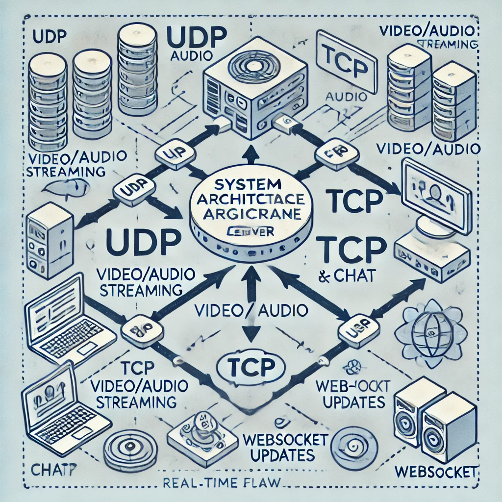
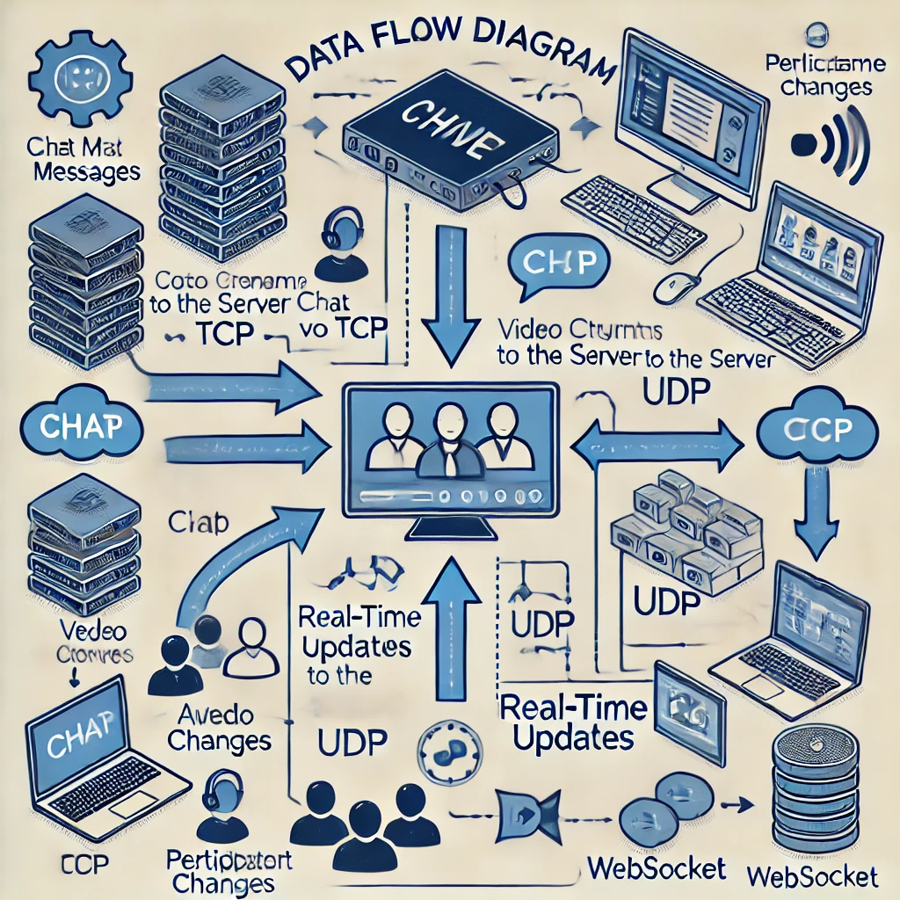
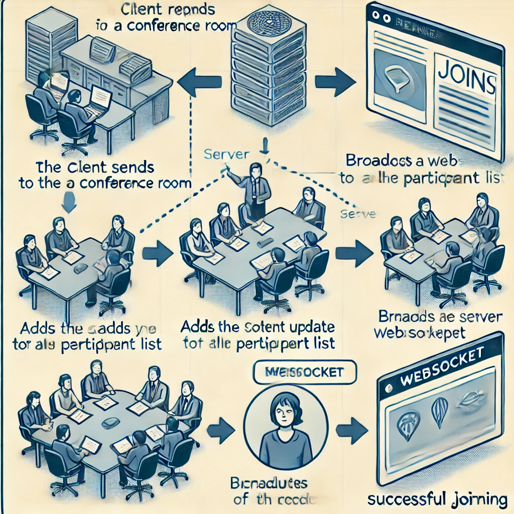
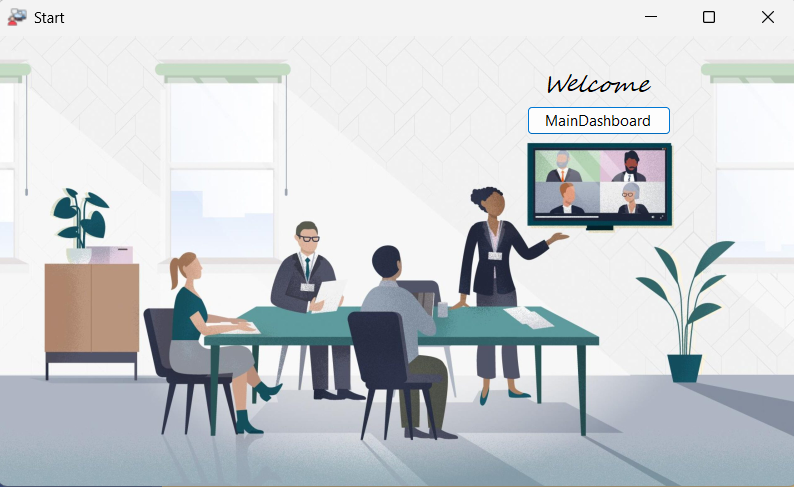
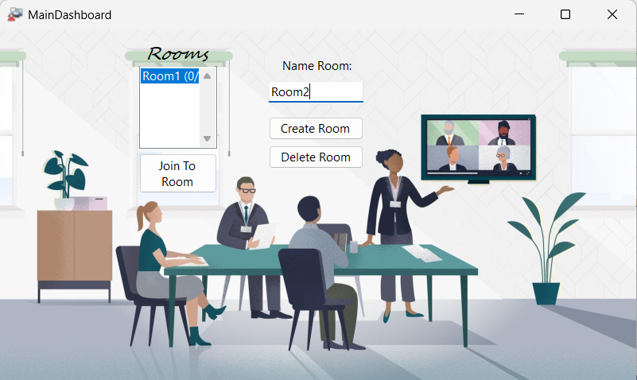
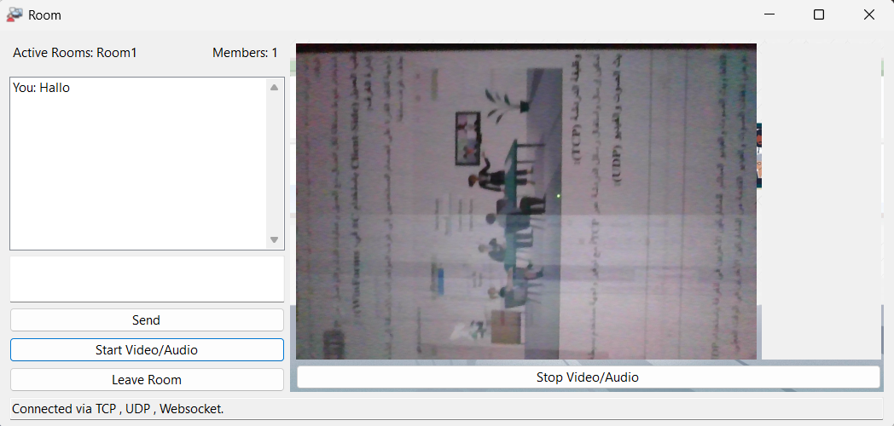

# Real-Time Conference Application

## Overview
- **Development Phases**:
   **Basic Server and Client Setup**: Set up TCP and UDP connections and basic client handling.
   **Feature Implementation**: Develop individual features like chat, video/audio streaming, and real-time updates.
   **Integration and Testing**: Combine features and perform comprehensive testing.
   **Final Documentation**: Ensure all code and processes are well-documented for submission.**

### Features
- **Conference Room Management**: Create, join, and delete conference rooms.
- **Text-Based Chat**: Real-time messaging using TCP.
- **Audio/Video Streaming**: Low-latency streaming using UDP.
- **Real-Time Updates**: Live notifications using WebSocket.
- **Multithreading**: Use threads to independently manage client connections and operations such as room management, streaming, and messaging.

### Technologies Used
- **Backend**: .NET Core with C#
- **Frontend**: C# (Console, WinForms)
- **Protocols**: TCP, UDP, WebSocket

---
| System Architecture           | Data Flow Diagrams          | Sequence Diagrams            |
|-------------------|-------------------|-------------------|
|  |  |  |

---

## Setup Instructions

### Prerequisites
- .NET Core SDK installed on your system.
- A compatible IDE (Visual Studio).
- Git for version control.

### Steps to Run

#### 1. Clone the Repository
```bash
git clone <(https://github.com/Oula97/ISE_NAP_S24.git)>
cd <ISE_NAP_S24_Oula_100060>
```

#### 2. Build the Project
Navigate to the server and client directories and build both applications:
```bash
cd RealTimeConferenceServer
 dotnet build
cd RealTimeConferenceClient
 dotnet build
```

#### 3. Start the Server
Run the server application:
```bash
cd RealTimeConferenceServer.sln
 dotnet run
```
---
| Run the server           | 
|-------------------|
|  

---
#### 4. Start the Client
Run the client application (multiple instances for testing):
```bash
cd RealTimeConferenceClient.sln
 dotnet run
```

#### 5. Test the Features
- Create or join conference rooms.
- Test real-time chat, video/audio streaming, and updates.

---
| Start           | MainDashboard            | RoomForm            |
|-------------------|-------------------|-------------------|
|  |  |  |

---
## Contribution Guidelines
- **Coding Standards**: Follow C# conventions and .NET best practices.
- **Commit Messages**: Use clear and concise messages.
- **Branch Naming**: Use descriptive branch names (e.g., `feature/chat-system`).
- **Code Reviews**: All features must be reviewed before merging.
- **Responsibilities**: Each team member should own a specific feature or module (e.g., WebSocket updates, TCP chat, UDP streaming).
- **Documentation**: Maintain a CHANGELOG.md file to document progress and changes for each feature.

---


## License
This project is licensed under the MIT License. See LICENSE.md for details.
